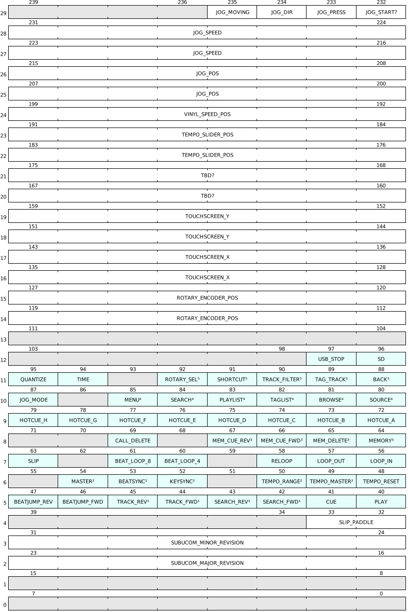
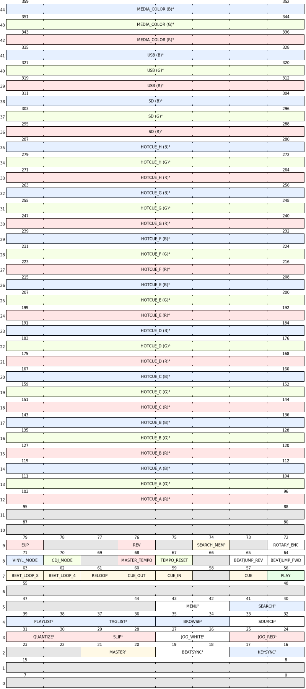

# cdj3k-subucom-tools

This package contains the CDJ3K Subucom Utilities.

Copyright (c) 2025 Magic Phono Development Team <xorbxbx@magicphono.org>

All files in this package can be freely distributed and used according
to the terms of the GNU General Public License, either version 2 or
(at your opinion) any newer version. See https://www.gnu.org/ for details.

## 1. What's that?

The CDJ3K Subucom Utilities package contains tools to interact with the
subucom controller from the main SoC of the AlphaTheta CDJ-3000 player.

The utilities include:

  - `subucom_blink`: blinks the LEDs continously, useful for testing.

  - `subucom_check`: checks for magic key press combo and writes output to file.

  - `subucom_dump`: reads subucom controller state and dumps to the screen
    continously.

  - `subucom_uinput`: userspace application that reads subucom controller
    state and emits events to an uinput virtual input device.

## 2. What's subucom?

Subucom (aka SUB MICROCOMputer) is a dedicated microcontroller in the CDJ that
manages the buttons and controls on the player, including the jog wheel,
touchscreen and LEDs. It is connected to the Main SoC via an SPI interface.

For protocol information, see Documentation section below.

## 3. Building

Build and install the cross-compile and SDK from
<a href="https://github.com/Magic-Phono/cdj3k-magicphono-distro">MagicPhono Linux</a>
and make sure the magicphono/oe environment is initialized before building.

To build, run:

```
  ./do_build.sh
```

The repo can be cleaned by running:

```
  make distclean
```


## 4. Documentation 

### Reading from subucom (Buttons)

#### CRC

The last two bytes (byte 62-63, 0-indexed) contain a CRC-16/X-25 checksum of the preceeding 62 bytes of data.


#### Data



<p>
<sup>1</sup> These keys are exclusive with one another.<br />
<sup>2</sup> These keys are exclusive with one another.<br />
<sup>3</sup> These keys are exclusive with one another.<br />
<sup>4</sup> These keys are exclusive with one another.<br />
<sup>5</sup> These keys are exclusive with one another.
</p>


### Writing to subucom (LEDs)

#### CRC

The last two bytes (byte 62-63, 0-indexed) contain a CRC-16/X-25 checksum of the preceeding 62 bytes of data.


#### Data<



<p>
<sup>1</sup> Dim/bright control. <code>00</code> - off, <code>01</code> - dim (10%), <code>10</code> - bright (100%), <code>11</code> - bright (100%).<br />
<sup>2</sup> Dim/bright control. <code>00</code> - off, <code>01</code> - dim (10%), <code>10</code> - off, <code>11</code> - bright (100%).<br />
<sup>3</sup> Affects TRACK_REV, TRACK_FWD, SEARCH_REV, SEARCH_FWD, MEMORY_CUE_REV and MEMORY_CUE_FWD LEDs.<br />
<sup>4</sup> R, G, B LEDs have 8 levels of brightness, where each bit increases the brightness level. <code>00000000</code> - off, <code>11111111</code> - 100% brightness.<br />
</p>
